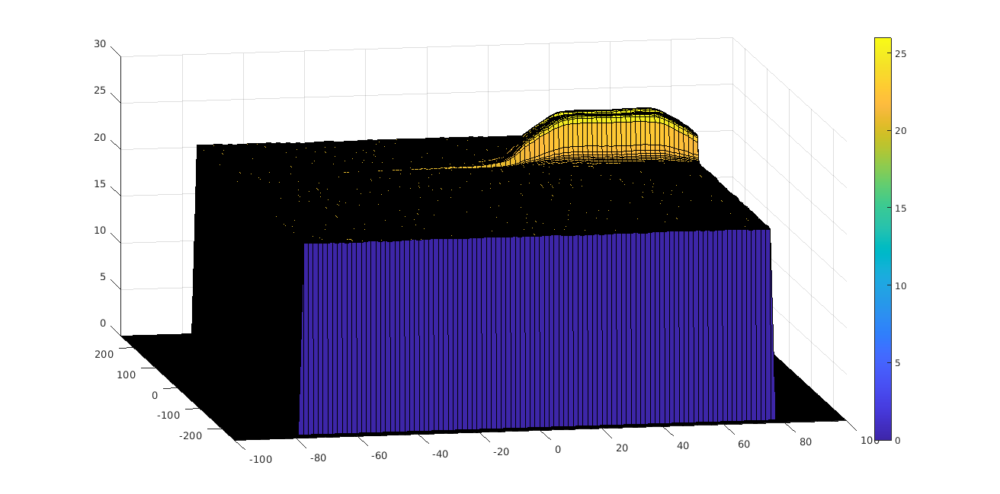

# 2D CFAR Implementation

## Implementation steps for the 2D CFAR process. 


* Determine the number of Training cells for each dimension. Similarly, pick the number of guard cells.

    >``` 
    > Tr = 10;
    > Td = 10;
    > Gr = 5;
    > Gd = 5;
    > offset = 6;
    >``` 

* Slide the cell under test across the complete matrix. Make sure the CUT has margin for Training and Guard cells from the edges. 

    >``` 
    >RDM2 = arrayfun(@db2pow,RDM);
    >for i = 1:(numRows-(2*Gd+2*Td)) 
    >    for j = 1:(numCols-(2*Gr+2*Tr)) 
    >        ...
    >    end
    >end
    >```

* For every iteration sum the signal level within all the training cells. To sum convert the value from logarithmic to linear using db2pow function. Values are previously converted to linear scale fro efficiency.
    
    >``` 
    >subm =  RDM2(i:i+2*Gd+2*Td, j:j+2*Gr+2*Tr); 
    >sumAll = sum(subm, 'all');
    >sumG = sum(subm(Td+1:Td+2*Gd+1, Tr+1:Tr+2*Gr+1), 'all');
    >noise = sumAll - sumG;
    >``` 

* Average the summed values for all of the training cells used. After averaging convert it back to logarithmic using pow2db.

    >```
    >num_elems = (2*Tr+2*Gr+1)*(2*Td+2*Gd+1) - (2*Gr+1)*(2*Gd+1);
    >thr = pow2db(noise / num_elems);
    >```

* Further add the offset to it to determine the threshold.

    >```
    >thr = db2pow(thr + offset);
    >```
* Next, compare the signal under CUT against this threshold. If the CUT level > threshold assign it a value of 1, else equate it to 0.

    >```
    >signal = RDM2(i+Tr+Gr, j+Td+Gd); 
    >cfar(i+Tr+Gr,j+Td+Gd) = double(signal > thr);
    >```

The output of the 2D CFAR process is the following:


## Selection of Training, Guard cells and offset.

It is selected 10 for Training Cells and 5 for Guard cells. Then average values for training cells is plotted:



Result shows that reference signal is smoothed.

Then offset is increased iterativelly until noise is removed (6 db). Next images show results for offsets 3 and 5 dbs:


## Steps taken to suppress the non-thresholded cells at the edges.

Before processing, it is created a matrix with same dimension as signal with 0 values:
>```
>cfar = zeros(numRows,numCols);
>```

Therefore depending on selected training/guard cells, these cells are ignored.